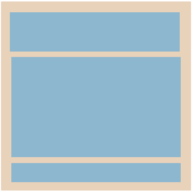
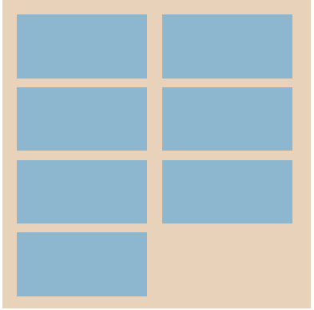

# Layouting

This tutorial describes the NUI Layouting framework, covering the following subjects:

[Overview](#overview)<br>
[Setting Layouts](#settingLayouts)<br>
[Sizing](#sizingLayouts)<br>
[Padding/Margins](#paddingAndMargins)<br>
[Minimum/Maximum sizes](#minimumAndMaximum)<br>
[Common Layouts](#commonLayout)<br>
[Creating custom Layouts](#customLayouts)<br>


<a name="overview"></a>
## Layouting Overview

The Layouting framework enables [View](https://developer.tizen.org/dev-guide/csapi/api/Tizen.NUI.BaseComponents.View.html) to be automatically positioned within a parent View that has been assigned a Layout.

The framework offers a common method to layout **Views** with just minimal setup in the application.

Especially, NUI Layouting provides advanced layouting capabilities in a reusable manner. It attempts to separate out the layouting logic from Views into distinct Layouters, so that a View's responsibility is just building and rendering the content.

Layouts are instances of specific Layouts

e.g. LinearLayout

 // TODO: Need to change the pic.

e.g GridLayout


Default layouts, such as [Linear Layout](linearlayout.md) and [Grid Layout](gridlayout.md), can be assigned to a View, and then children added to this View will be positioned
and sized according to that layout in conjunction with specification and properties set on the layout and Views.

Also, the layouting framework allows nested layouting; View with a layout can be added to another View with a layout.

A View can be assigned any Layout and re-assigned to a different Layout but a Layout can only be used with one View at a time.

New layouts can be implemented by deriving from the Layouting base class and positioning the children in any way required. If you want to create `Custom Layout`, see [Creating custom Layouts](#customLayouts) for instructions.


## Lay out a View

<a name="settingLayouts"></a>
### Setting a layout to a View

For a View to perform the desired layouting for its children, it needs to have a layout created and set to it. NUI Layout may need extra settings to be provided. For example, a `GridLayout` can have the number of columns set on it.

Below code snippet creates a View, creates a LinearLayout and then sets the layout on the View.

~~~{.cs}
View parentView = new View();
parentView.Name = "LinearExample";

var layout = new LinearLayout();
layout.LinearOrientation = LinearLayout.Orientation.Horizontal;

parentView.Layout = layout;
~~~

In the case, the linear layout has the Horizontal orientation set on it as `LinearLayout` can be vertical or horizontal.

A View can be assigned a new layout. This will cause it's children to be repositioned as described by the new layout.
A Layout can only be assigned to a single View at a time, trying to assign the same layout to multiple Views will result in only the last assigned View to have that layout.
A default Layout will be assigned if a layout is moved from one View to another.

~~~{.cs}
View parentView = new View();
parentView.Name = "LinearExample";

var layoutLinear = new LinearLayout();
layout.LinearOrientation = LinearLayout.Orientation.Horizontal;

parentView.Layout = layoutLinear;

...
someAction.Event += (sender, e) =>
{
  parentView.Layout = new GridLayout();;
}
~~~

Code above changes the layout from `LinearLayout` to `GridLayout` on a event occurance.


<a name="sizingLayouts"></a>
### Sizing and Specifications

There are 2 size specifications available for Views : Setting **explicit value** and Using **Layout Parameters**.

Size specifications are ways to specify the preferred size of Views within the layouting framework. Height and Width are individual, so each can be set with a different specification.

1. An **explicit value** can be provided, either using the existing Size API or setting a pixel value to the specification. User can specify the width and height with the exact measurement.

- Using [Size](https://developer.tizen.org/dev-guide/csapi/api/Tizen.NUI.Size.html) API
~~~{.cs}
View childView = new View();
childView.Size  = new Size(90, 90);
~~~

or

- Using [Specification]() API
~~~{.cs}
View childView = new View();
childView.WidthSpecification = 90;
childView.HeightSpecification = 90;
~~~

  // TODO: Need to change the pic.

2. **Layout Parameters** can set the width or height with the relative value of its children or its parent.

- [LayoutParamPolicies.WrapContent] : Setting a `View`'s height or width specification to `WrapContent` will cause the View to grow or shrink to wrap around the size of its children.

~~~{.cs}
View childView = new View();
childView.WidthSpecification = LayoutParamPolicies.WrapContent;
childView.HeightSpecification = LayoutParamPolicies.WrapContent;
~~~

  // TODO: Need to change the pic.

- [LayoutParamPolicies.MatchParent] : Setting a `View`'s height or width specification to `MatchParent` will cause the View to fill the size of its parent.

~~~{.cs}
View childView = new View();
childView.WidthSpecification = LayoutParamPolicies.MatchParent;
childView.HeightSpecification = LayoutParamPolicies.MatchParent;
~~~

  // TODO: Need to change the pic.


<a name="paddingAndMargins"></a>
### Padding and Margin

`Padding` and `Margin` provide additional control within a layout to achieve a desired look.

Both padding and margin are 4 values represented by the [Extents](https://developer.tizen.org/dev-guide/csapi/api/Tizen.NUI.Extents.html) class : start, top, end, bottom.

Padding is the internal space between the boundary of the View and its content. A View with a layout will have child Views as content whilst a leaf View (for example, `ImageView`) would have an ImageVisual as its content.

`Padding` can be provided to a Layout View to give an offset to its children.

~~~{.cs}
View layoutView = new View();
var layout = new LinearLayout();
layoutView.Layout = layout;

layoutView.Padding = new Extents(10,0,10,0);

View childView = new View();
childView.WidthSpecification = LayoutParamPolicies.MatchParent;
childView.HeightSpecification = LayoutParamPolicies.MatchParent;

layoutView.Add(childView);
~~~

  // TODO: Need to change the pic.


`Margin` is the external space around a View. Providing a child View with a margin will offset the positioning of just that child. Whilst setting the padding on the parent View will offset all the children.

~~~{.cs}
View layoutView = new View();
var layout = new LinearLayout();
layoutView.Layout = layout;

View childView = new View();
childView.WidthSpecification = LayoutParamPolicies.WrapContent;
childView.HeightSpecification = LayoutParamPolicies.WrapContent;
childView.Margin = new Extents(10,0,10,0);

View childView2 = new View();
childView2.WidthSpecification = LayoutParamPolicies.WrapContent;
childView2.HeightSpecification = LayoutParamPolicies.WrapContent;
childView2.Margin = new Extents(10,0,10,0);

layoutView.Add(childView);
layoutView.Add(childView2);

~~~

  // TODO: Need to change the pic.

<a name="minimumAndMaximum"></a>
### Minimum and Maximum Sizes

The layouting framework has control over the size of the Views it lays out.  The size of a child view may need to be smaller or larger than it's natural size or specified size.

To guide the framework a preferred minimum and maximum size can be provided if a preference exists. The layouting system will then try to keep the size of the View within the given values.

Minimum or maximum sizes could be used with the `MatchParent` or `WrapContent` of `LayoutParamPolicies`.

If specifying an explicit size and setting the minimum or maximum, ensure the explicit size is within the minimum and maximum boundary.

~~~{.cs}
View childView = new View();
childView.WidthSpecification = LayoutParamPolicies.WrapContent;
childView.HeightSpecification = LayoutParamPolicies.WrapContent;
childView.MinimumSize = new Size2D(200,200);
childView.MaximumSize = new Size2D(400,400);
~~~


<a name="commonLayout"></a>
## Common Layouts

Below are the available Layouts that have been implemented and ready to be assigned to Views.

Each Layout has its own unique properties, such as `AlignmentType` in `LinearLayout`.

| [LinearLayout](./linear-layout.md) | [GridLayout](./grid-layout.md) | [FlexLayout](./flex-layout.md) |
| -----------------------| --------------- | ------------ |
| { width=50% } | { width=50% }  | { width=50% } |
| A linear box layout, automatically handling children laid out vertically or horizontally. | A grid box for the two-dimensional layout. | A flexible box layout, providing a more efficient way to lay out, align and distribute space among items in the container, even when their size is unknown or dynamic. |


<a name="customLayouts"></a>
## Creating Custom Layouts

### OnMeasure and OnLayout

You can create custom layouts with the fundamental layout of NUI for building your own layouting.

Or you can just use the available laayouts, such as `LinearLayout` and `GridLayout`. For more information, see [Common Layouts](#commonLayout) category.

Custom layouts can be created for use in applications or to add to the current "Toolkit".

The custom layout must derive from `LayoutGroup` and override the 2 methods : `OnMeasure` and `OnLayout` described below.

When creating a custom Layout, these are the methods that should be extended and will be called during the Measure and Layout phases respectively. And the layouting framework does all the heavy work leaving just the Measuring and Layouting to the Custom Layout.

Layouting is a 2 phase process :

First, Measuring of the children hence determining the layouts own dimensions.

Second, Layouting (Positioning) the children within itself using their measured sizes.

1. ```protected override void OnMeasure( MeasureSpecification widthMeasureSpec, MeasureSpecification heightMeasureSpec )```

    The `OnMeasure` is the first function to overrid that 2 parameters are provided. They're the parents' width and height MeasureSpecifications which impose the size that the custom layout can be.

    Then, the Custom layout should measuure its children.
    To measure children size, `MeasureChild` API is available along with children which is an List of the Layouts children. It can be used to iterate and measure each one.

    After the children are measured, the Custom Layout can add up their height and width together in any way it needs to.
    Finally, the `SetMeasuredDimensions` API with the size is called it needs to be.

2. ```protected override void OnLayout( bool changed, LayoutLength left, LayoutLength top, LayoutLength right, LayoutLength bottom )```

    The `OnLayout` is where the children are positioned using the Layout API which takes a frame : start, top, end, bottom.
    The positioning of the vertices of the child in turn defines its size.

    As in the `OnMeasure` the children List can be iterated to get each child in the Layout, then the `MeasuredWidth` and `MeasuredHeight` can be queried on each child.

### LayoutLength

`LayoutLength` is a class which encapsulates either the height or width value used in Layouting.  The value can be set by passing in a integer or float and retrieved as a decimal or rounded value. The rounded value should be used in outputting like when setting measured dimensions. The decimal value should be used during calculations.

It is up to the layout to deal with the floating point to rounded number differences. For example, dividing a length of 100 between 3 columns could result in a column 33,34,33. Which would be preferable to 33,33,33 and 1 being undefined.

### Example code for a Custom Layout positioning children in a horizontal line.

The following code snippet explains shows how to create a custom layout.

~~~{.cs}

using Tizen.NUI;
using Tizen.NUI.BaseComponents;

namespace SimpleLayout
{
    internal class CustomLayout : LayoutGroup
    {
        protected override void OnMeasure( MeasureSpecification widthMeasureSpec, MeasureSpecification heightMeasureSpec )
        {
            var accumulatedWidth = new LayoutLength(0);
            var maxHeight = 0;
            var measuredWidth = new LayoutLength(0);
            LayoutLength measuredHeight = new LayoutLength(0) ;
            MeasureSpecification.ModeType widthMode = widthMeasureSpec.Mode;
            MeasureSpecification.ModeType heightMode = heightMeasureSpec.Mode;

            bool isWidthExact = (widthMode == MeasureSpecification.ModeType.Exactly);
            bool isHeightExact = (heightMode == MeasureSpecification.ModeType.Exactly);

            // In this layout we will:
            //  Measuring the layout with the children in a horizontal configuration, one after another
            //  Set the required width to be the accumulated width of our children
            //  Set the required height to be the maximum height of any of our children

            foreach (LayoutItem childLayout in _children)
            {
                if( childLayout != null )
                {
                    MeasureChild( childLayout, widthMeasureSpec, heightMeasureSpec );
                    accumulatedWidth += childLayout.MeasuredWidth.Size;
                    maxHeight = (int)System.Math.Ceiling(System.Math.Max( childLayout.MeasuredHeight.Size.AsRoundedValue(), maxHeight ));
                }
            }

            measuredHeight = new LayoutLength(maxHeight);
            measuredWidth = accumulatedWidth;

            if( isWidthExact )
            {
                measuredWidth = new LayoutLength( widthMeasureSpec.Size );
            }

            if( isHeightExact )
            {
                measuredHeight = new LayoutLength( heightMeasureSpec.Size );
            }

            // Finally, call this method to set the dimensions we would like
            SetMeasuredDimensions( new MeasuredSize( measuredWidth, MeasuredSize.StateType.MeasuredSizeOK),
                                   new MeasuredSize( measuredHeight, MeasuredSize.StateType.MeasuredSizeOK) );
        }

        protected override void OnLayout( bool changed, LayoutLength left, LayoutLength top, LayoutLength right, LayoutLength bottom )
        {
            LayoutLength childLeft = new LayoutLength( 0 );

            // We want to vertically align the children to the middle
            LayoutLength height = bottom - top;
            float middle = height.AsDecimal() / 2;

            // Horizontally align the children to the middle of the space they are given too
            LayoutLength width = right - left;
            int count = _children.Count;
            int childIncrement = 0;
            if (count > 0)
            {
                childIncrement = (int)System.Math.Ceiling(width.AsDecimal() /  count);
            }
            float center = childIncrement / 2;

            // Check layout direction
            var view = GetOwner();
            ViewLayoutDirectionType layoutDirection = view.LayoutDirection;

            for ( int i = 0; i < count; i++ )
            {
                int itemIndex = i;
                // If RTL, then layout the last item first
                if (layoutDirection == ViewLayoutDirectionType.RTL)
                {
                    itemIndex = count - 1 - i;
                }

                LayoutItem childLayout = _children[itemIndex];
                if(childLayout != null)
                {
                    LayoutLength childWidth = childLayout.MeasuredWidth.Size;
                    LayoutLength childHeight = childLayout.MeasuredHeight.Size;

                    LayoutLength childTop = new LayoutLength(middle - (childHeight.AsDecimal()/2));

                    LayoutLength leftPosition = new LayoutLength(childLeft.AsDecimal() + center - childWidth.AsDecimal()/2);

                    childLayout.Layout( leftPosition,
                                        childTop,
                                        leftPosition + childWidth,
                                        childTop + childHeight );
                    childLeft += new LayoutLength(childIncrement);
                }
            }
        }
    }
}

~~~

## Related information

- Dependencies
  -  Tizen 5.5 and Higher
